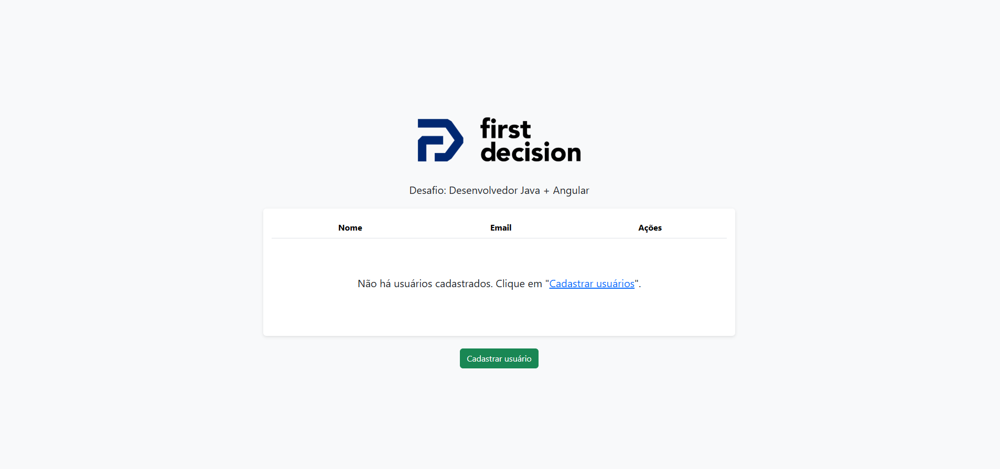

# Desafio API - Frontend Angular
  

Aplicação desenvolvida como parte de um desafio técnico Full Stack. Este projeto consiste em uma interface frontend construída com Angular para gerenciar usuários, realizando operações de cadastro, edição, listagem e exclusão. A aplicação consome uma API REST desenvolvida com Spring Boot.

## 🔧 Tecnologias Utilizadas

- Angular 17
- TypeScript
- HTML5 & SCSS
- Bootstrap
- RxJS (observables para requisições HTTP)
- Testes com Jasmine e Karma

## 🎯 Funcionalidades

- ✅ Listagem de usuários em uma tabela.
- ✅ Cadastro de novos usuários com validação de campos obrigatórios.
- ✅ Confirmação de senha no formulário de cadastro.
- ✅ Edição de usuários existentes.
- ✅ Exclusão com confirmação via `window.confirm`.
- ✅ Validações reativas (ex: campos obrigatórios, e-mail válido).
- ✅ Mensagens de sucesso e erro conforme retorno da API.
- ✅ Testes unitários de componentes.

## 🔄 Integração com API

Esta aplicação consome a API disponibilizada no repositório:  
➡️ [`desafio-api-back`](https://github.com/RafaelCastro137/back-angular-spring)

A comunicação é feita via `HttpClient` com métodos como `get`, `post`, `put` e `delete` de acordo com o endpoint.

## ▶️ Como executar

### Pré-requisitos

- Node.js (v18 ou superior)
- Angular CLI (`npm install -g @angular/cli`)
- Git

### Passos para rodar o projeto

```bash
# Clone o repositório
git clone https://github.com/RafaelCastro137/desafio-api-front.git
cd desafio-api-front

# Instale as dependências
npm install

# Execute o servidor de desenvolvimento
ng serve

# Acesse a aplicação
http://localhost:4200
